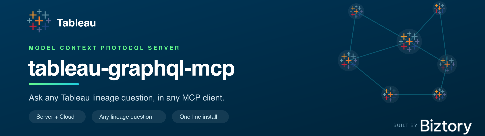
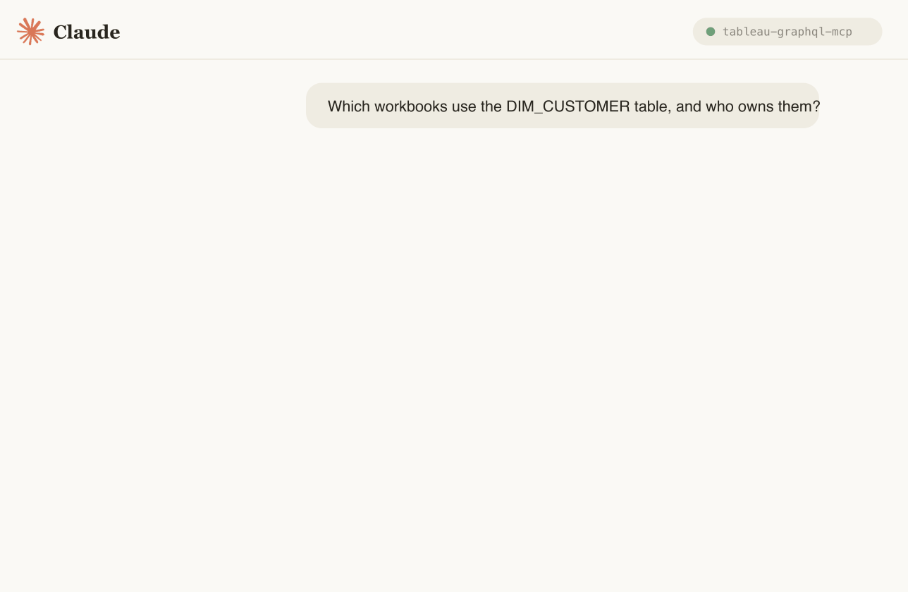
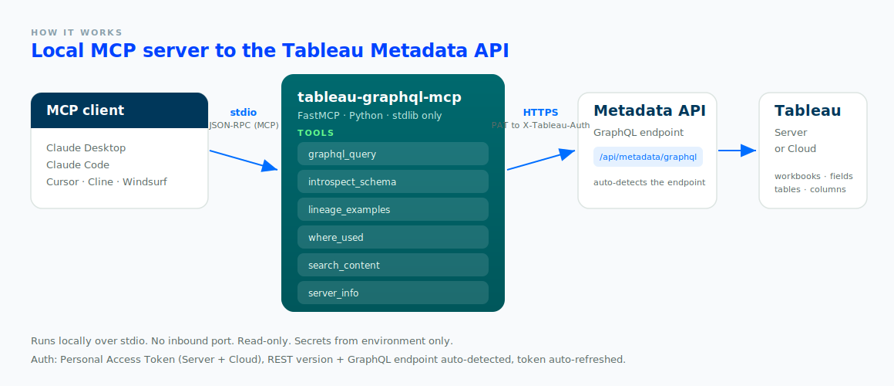

<!-- mcp-name: io.github.tdries/tableau-graphql-mcp -->

<p align="center">
  
</p>

<h1 align="center">tableau-graphql-mcp</h1>

<p align="center"><em>Ask any Tableau lineage question, in any MCP client, through the Tableau Metadata API.</em></p>

<p align="center">
  <a href="https://github.com/tdries/tableau-graphQL-mcp/actions/workflows/ci.yml"></a>
  <a href="https://github.com/tdries/tableau-graphQL-mcp/actions/workflows/codeql.yml"></a>
  <a href="https://codecov.io/gh/tdries/tableau-graphQL-mcp"></a>
  <a href="https://github.com/astral-sh/ruff"></a>
  <a href="https://pypi.org/project/tableau-graphql-mcp/"></a>
  <a href="https://pepy.tech/project/tableau-graphql-mcp"></a>
  
  
  <a href="LICENSE"></a>
  
  
</p>

<p align="center">
  <a href="cursor://anysphere.cursor-deeplink/mcp/install?name=tableau-graphql&config=eyJjb21tYW5kIjogInV2eCIsICJhcmdzIjogWyJ0YWJsZWF1LWdyYXBocWwtbWNwIl19"></a>
</p>

<p align="center">
  
</p>

---

**tableau-graphql-mcp** turns your Tableau site's [Metadata API](https://help.tableau.com/current/api/metadata_api/en-us/index.html) into a set of MCP tools, so an AI assistant (Claude, Cursor, Cline, and others) can answer lineage questions in plain language:

- _"If I drop the column `SALES`, which workbooks break?"_
- _"What tables does the **Sales Overview** workbook depend on?"_
- _"Which calculated fields reference `Profit`, and on which dashboards?"_
- _"Who should I notify before changing the `DIM_CUSTOMER` table?"_

It ships **seven curated tools**: a universal GraphQL passthrough, live schema introspection, an embedded library of correct query templates, a robust `where_used` resolver, a multi-hop `impact_analysis`, a substring content search, and a connection probe. Together they let the model answer *any* lineage question, not just a fixed menu.

### Why it's different
- **Any question, done right.** `graphql_query` runs any read-only GraphQL; `introspect_schema` and a built-in cheat-sheet plus 28 worked examples keep the model's queries correct.
- **True impact analysis (multi-hop).** `impact_analysis` follows the *whole* dependency chain — a calc built on a calc built on a column is included — and returns the full blast radius plus the de-duplicated **owners to notify**, not just direct references.
- **Works everywhere.** Tableau **Server** *and* **Cloud**. The REST API version and the GraphQL endpoint (`/api/metadata/graphql`, with a `/relationship-service-war/graphql` fallback) are **auto-detected**.
- **Robust lineage without Catalog.** `where_used` resolves workbooks via core lineage (`referencedByFields -> sheets -> workbook`), so it works even when the Data Management add-on's `downstreamWorkbooks` is empty.
- **No silent truncation.** `graphql_query` flags `partial_results` when a query hits the node limit, and `search_content` reports `scanned`/`total` coverage — so a truncated answer is never mistaken for a complete one.
- **Tiny and safe.** Read-only, stdio-only (no inbound port), secrets from env only, and **no dependencies beyond the MCP SDK** (stdlib `urllib` for HTTP).

## Quickstart

You need [`uv`](https://docs.astral.sh/uv/) (`curl -LsSf https://astral.sh/uv/install.sh | sh`) and a Tableau [Personal Access Token](https://help.tableau.com/current/server/en-us/security_personal_access_tokens.htm).

**Claude Code, one line:**

```bash
claude mcp add tableau-graphql \
  -e TABLEAU_SERVER=https://10ax.online.tableau.com \
  -e TABLEAU_SITE_CONTENT_URL=YourSite \
  -e TABLEAU_PAT_NAME=my-token \
  -e TABLEAU_PAT_SECRET=the-full-secret \
  -- uvx tableau-graphql-mcp
```

That's all. `uvx` fetches the package from PyPI and runs it in an isolated environment; nothing to clone or install (and no `git` required). Then ask Claude a lineage question.

## Configuration

All configuration is via environment variables (set them in your client's `env` block, never on the command line).

| Env var | Required | Default | Description |
|---|:---:|---|---|
| `TABLEAU_SERVER` | yes | n/a | `https://tableau.company.com` (Server) or `https://<pod>.online.tableau.com` (Cloud). |
| `TABLEAU_SITE_CONTENT_URL` | no | `""` | Site slug (the part after `/#/site/`). Empty = Default site (Server only); Cloud always has one. |
| `TABLEAU_PAT_NAME` | yes¹ | n/a | Personal Access Token **name**. |
| `TABLEAU_PAT_SECRET` | yes¹ | n/a | PAT **secret**: the whole string, do **not** split on `:`. |
| `TABLEAU_TIMEOUT` | no | `60` | Per-request timeout (seconds). |
| `TABLEAU_API_VERSION` | no | auto | REST API version; else read from `/api/serverinfo`. |
| `TABLEAU_METADATA_PATH` | no | auto | Override the GraphQL path; else auto-detected. |
| `TABLEAU_AUTH_TOKEN` | no | n/a | Advanced: a pre-obtained `X-Tableau-Auth` token (SSO tenants where PATs are disabled). |
| `TABLEAU_COOKIE` | no | n/a | Advanced: a browser session cookie (SSO fallback). |

¹ Provide a PAT (`TABLEAU_PAT_NAME` + `TABLEAU_PAT_SECRET`) **or** an advanced `TABLEAU_AUTH_TOKEN` / `TABLEAU_COOKIE`.

<details>
<summary><b>Claude Desktop</b></summary>

Edit `claude_desktop_config.json` (macOS: `~/Library/Application Support/Claude/`, Windows: `%APPDATA%\Claude\`):

```json
{
  "mcpServers": {
    "tableau-graphql": {
      "command": "uvx",
      "args": ["tableau-graphql-mcp"],
      "env": {
        "TABLEAU_SERVER": "https://10ax.online.tableau.com",
        "TABLEAU_SITE_CONTENT_URL": "YourSite",
        "TABLEAU_PAT_NAME": "my-token",
        "TABLEAU_PAT_SECRET": "the-full-secret"
      }
    }
  }
}
```

Fully **quit and reopen** Claude Desktop, then check the tools menu.
</details>

<details>
<summary><b>Cursor</b> · <b>Cline</b> · <b>Windsurf</b></summary>

Every client uses the same `mcpServers` schema shown above. Add the same block to:
- **Cursor**: `~/.cursor/mcp.json` (global) or `.cursor/mcp.json` (project).
- **Cline**: the MCP Servers panel, then *Configure*, into `cline_mcp_settings.json`.
- **Windsurf**: `~/.codeium/windsurf/mcp_config.json`.

On Windows, if `uvx` isn't found by the GUI app, use its absolute path (e.g. `%USERPROFILE%\.local\bin\uvx.exe`).
</details>

## Tools

| Tool | What it does | Key args |
|---|---|---|
| `graphql_query` | Run **any** read-only Metadata API GraphQL query. The general tool for any lineage question. | `query`, `variables` |
| `introspect_schema` | Live schema introspection: list entry points, or a type's exact fields. | `type_name` |
| `lineage_examples` | A schema cheat-sheet plus 28 curated question-to-GraphQL templates (8 categories). | `category` |
| `where_used` | Which workbooks/datasources use given column / field / table names (robust one-hop core-lineage resolution). | `names` |
| `impact_analysis` | Full transitive **multi-hop** blast radius of a column/field/table: every dependent field, plus affected sheets, dashboards, workbooks, and **owners to notify**. | `name` |
| `search_content` | Find content whose **name contains** a term (case-insensitive substring), across workbooks, datasources, tables (and optionally fields/columns), with coverage numbers. | `term`, `types` |
| `server_info` | Connected server, site, versions, endpoint, auth, and whether Catalog lineage is available. | none |

All tools are **read-only**. The Metadata API has no mutations.

## Example prompts

Once connected, try:

- _"Use server_info to confirm what you're connected to."_
- _"Search for anything with 'revenue' in the name."_
- _"Which workbooks use the columns SALES, PROFIT and DISCOUNT? Group by owner."_
- _"Show me the field-to-source-column map for the 'Sales Overview' workbook."_
- _"List every calculated field in that workbook with its formula."_
- _"Which published datasources feed workbooks in the Analytics project, and which are uncertified?"_
- _"Run impact_analysis on the 'Profit Ratio' field: every dependent sheet, dashboard, workbook, and owner to notify."_
- _"What is the blast radius of dropping the DIM_CUSTOMER table: workbooks, sheets, and owners to notify?"_

## Architecture

<p align="center"></p>

The server speaks MCP over **stdio** to the client and HTTPS to Tableau: it signs in with your PAT to get an `X-Tableau-Auth` token (auto-refreshed on expiry), auto-detects the REST API version and the GraphQL endpoint, then forwards queries to the Metadata API. Nothing is stored; every answer is live.

## Security

- **Read-only, enforced.** Only GraphQL queries: no writes, no shell. `graphql_query` rejects `mutation`/`subscription` operations, and the Metadata API is query-only regardless.
- **Local and stdio-only.** No inbound network port is opened.
- **Secrets from env only.** Never passed as tool arguments, never logged, never returned in output.
- **Least privilege.** The PAT inherits your Tableau permissions; the API only returns content you can see.
- Pin a version in production: `uvx tableau-graphql-mcp==0.1.0`.

See [SECURITY.md](SECURITY.md).

## Troubleshooting

| Symptom | Fix |
|---|---|
| Server doesn't appear | Fully quit and relaunch the client; check the config path and JSON validity. |
| `spawn uvx ENOENT` | Install `uv`, or use the absolute path to `uvx`. |
| Sign-in fails (401) | Check the PAT name/secret and `TABLEAU_SITE_CONTENT_URL`. On SSO tenants PATs may be disabled; use `TABLEAU_AUTH_TOKEN`/`TABLEAU_COOKIE`. |
| "Could not reach the Metadata API" | On Tableau **Server**, an admin must enable it: `tsm maintenance metadata-services enable`. On Cloud it is always on. |
| Empty `downstreamWorkbooks` | Expected without the Data Management add-on; use the `where_used` tool, which resolves via core lineage. |

Inspect the server directly with the MCP Inspector:

```bash
npx @modelcontextprotocol/inspector uvx tableau-graphql-mcp
```

## Development

```bash
git clone https://github.com/tdries/tableau-graphQL-mcp && cd tableau-graphQL-mcp
uv sync --all-extras
uv run tableau-graphql-mcp                     # run from source
uv run pytest --cov=tableau_graphql_mcp        # tests + coverage (offline; no Tableau needed)
uv run ruff check .                            # lint
uv run ruff format --check .                   # format
```

The same three gates (lint, format, tests with a 85% coverage floor) run in CI across
Linux/macOS/Windows and Python 3.10 to 3.13. Coverage is reported to Codecov and the code is
scanned by CodeQL on every push.

The same gates run in CI (Linux/macOS/Windows, Python 3.10 to 3.13): `ruff check`,
`ruff format --check`, `mypy --strict`, and `pytest` with a coverage floor. The package
ships a PEP 561 `py.typed` marker, so importing it gives your type checker full types.

Contributions welcome: see [CONTRIBUTING.md](CONTRIBUTING.md) and the [Code of Conduct](CODE_OF_CONDUCT.md).

## Roadmap

Shipped: published on [PyPI](https://pypi.org/project/tableau-graphql-mcp/) and listed on the
official [MCP registry](https://registry.modelcontextprotocol.io/v0/servers?search=tableau-graphql).
Next:

- [ ] Optional Data Management path: richer `downstreamWorkbooks` when Catalog is present
- [ ] More curated query templates in `lineage_examples`
- [ ] Optional response caching for repeated introspection within a session

Ideas and votes welcome in [Discussions](https://github.com/tdries/tableau-graphQL-mcp/discussions).

## License

[MIT](LICENSE) © Tim Dries. Built at [Biztory](https://www.biztory.com).
